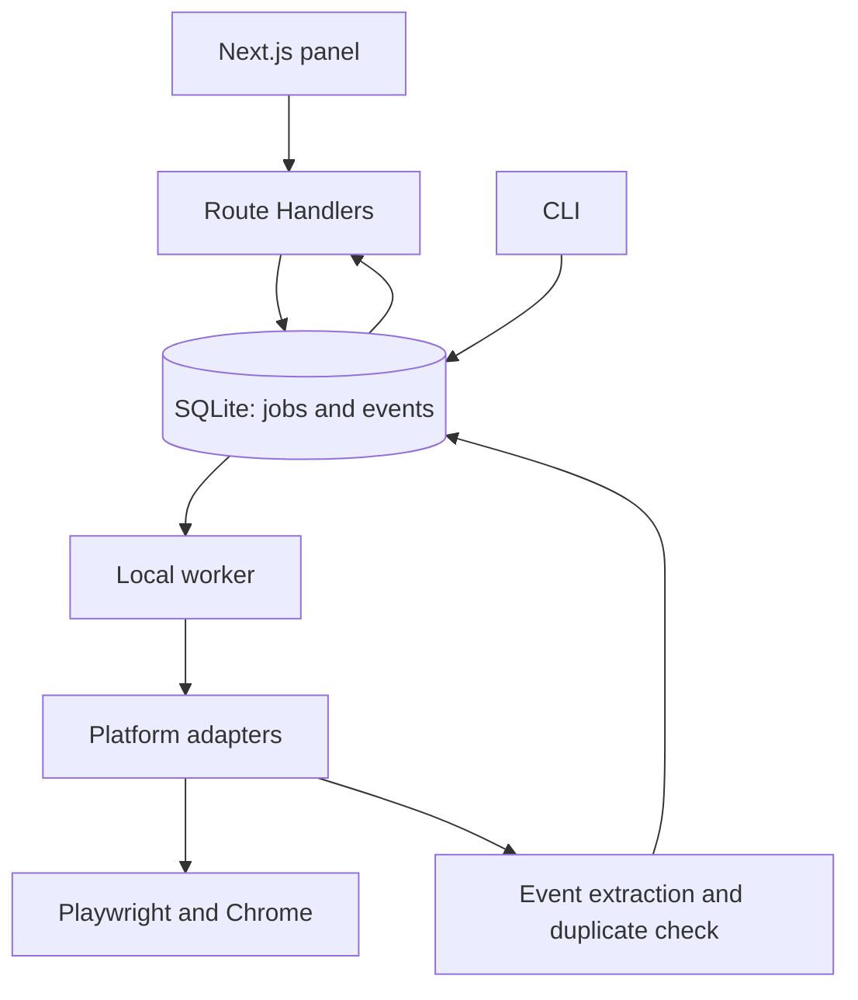

**Event Radar — Next.js project architecture and MVP development plan**

This document is the development plan for a personal event-discovery app that
runs on a MacBook. It is not a delivered, live-tested product. The UI is built
with Next.js; Playwright automation runs in a separate Node.js worker process
inside the same project. All application data and browser sessions stay on the
local machine. Internet access is required to reach social media sites.

**1. Core architecture decision**

A single repository and a single application package are enough. The Next.js
panel, API layer, CLI and worker share the same TypeScript types and services.
A separate Express server, Redis, Docker or a paid scraping service is not
needed for the first release.

| Layer | Choice | Responsibility |
| --- | --- | --- |
| Panel | Next.js App Router, TypeScript | Events, scan form, results, connection status |
| UI | Tailwind CSS, shadcn/ui | Tables, filters, forms, dialogs, status indicators |
| Forms and validation | React Hook Form, Zod | Validate scan options and settings |
| Live status | TanStack Query, periodic polling | Refresh counters of the running scan |
| HTTP API | Next.js Route Handlers, Node.js runtime | Create jobs, read status, request cancellation, edit events |
| Scanning | Separate Node.js + TypeScript worker | Queue, browser ownership, adapter execution |
| Browser | Playwright, visible Chrome | Session usage and social media navigation |
| Database | SQLite + Drizzle ORM + better-sqlite3 | Events, sources, jobs, progress |
| Tooling | tsx, Pino | TypeScript CLI/worker and structured logging |
| Verification | Vitest, Playwright | Parser/dedup tests and app acceptance scenarios |

Current, mutually compatible stable versions are selected at install time and
pinned by the lockfile. The Node version is pinned in the project as well.
Drizzle's SQLite and better-sqlite3 support is in the official docs [3].
Next.js routes that need Node APIs use the Node.js runtime [4].

Intended data flow:



`POST /api/scans` persists the job to the database and returns `202 Accepted`
with a `runId`. The worker picks up the next job. Browser work starts inside a
well-defined job and is never left running unowned in the background. If the
panel closes, the worker can continue the scan; shutting down the machine or
the worker interrupts the scan.

**2. Chrome session**

Being logged in inside the user's regular Chrome does not mean Playwright can
attach to that session automatically. Chrome 136 restricted
`--remote-debugging-port` and `--remote-debugging-pipe` with the default data
directory; these switches require a non-default `--user-data-dir` [1].
Playwright also does not support driving the default Chrome profile in
automation [2].

Two operating modes are designed:

| Mode | Behavior |
| --- | --- |
| `cdp` | Connects with `connectOverCDP` to a Chrome that the user started with a suitable separate data directory and debugging enabled. Uses the existing sessions of that profile. |
| `persistent` | Opens the app-dedicated persistent profile with `launchPersistentContext`. On first use the user signs in to LinkedIn/X in the browser; the profile is kept for later runs. |

The default MVP mode is `persistent`. `cdp` can be selected when a valid CDP
endpoint is provided. If a platform terminates the session, the user must sign
in again; no permanent session guarantee is given.

The profile, SQLite database and logs are kept separate from project code.
Suggested macOS data root: `~/Library/Application Support/EventRadar/`. The
app resolves this to an absolute path. Sub-paths: `browser-profile/` for the
profile, `events.sqlite` for the database, `logs/` for logs. OS file
permissions are restricted to the user.

The profile is managed by a single worker. If a second process tries to open
the same profile, a clear error is raised. In `cdp` mode the worker closes
only the tabs it opened; it never closes the user's browser. In persistent
mode it closes the context it created. CDP connects to loopback addresses
only.

The Connections page shows `ready`, `login_required`, `challenge`,
`unsupported` and `error` states. Session checks and browser-opening commands
are also executed by the worker; Next.js never opens a second profile.
Passwords are never entered through the app's forms. Cookie/session values
are never written to code, logs, API responses or export files.

**3. Folder and file structure**

| Path | Contents |
| --- | --- |
| `src/app/layout.tsx` | Root app layout |
| `src/app/page.tsx` | Overview screen |
| `src/app/events/page.tsx` | Event list |
| `src/app/events/[id]/page.tsx` | Event, evidence text and sources |
| `src/app/scans/page.tsx` | New scan and history |
| `src/app/scans/[id]/page.tsx` | Progress, counters, platform errors |
| `src/app/connections/page.tsx` | Chrome and platform session status |
| `src/app/settings/page.tsx` | Keywords, hashtags, limits |
| `src/app/api/` | HTTP endpoints; thin validation and service calls |
| `src/components/ui/` | shadcn/ui components |
| `src/features/events/` | Event table, filters, detail and editing |
| `src/features/scans/` | Scan form and progress components |
| `src/features/connections/` | Platform connection cards |
| `src/core/types/` | Event, SocialPost, ScanOptions and adapter contracts |
| `src/core/parsers/` | event-parser, date-parser, location-parser, url-parser |
| `src/core/services/` | event-service, duplicate-detector, scan-service, config-service |
| `src/core/config/` | Zod schemas, defaults and the config loader |
| `src/core/utils/` | Text normalization, date and URL helpers |
| `src/platforms/registry.ts` | Registry of available adapters |
| `src/platforms/linkedin/` | adapter.ts, selectors.ts, post-parser.ts, search-builder.ts |
| `src/platforms/twitter/` | Same files for X; the application platform key is `x` |
| `src/platforms/instagram/` | Second-phase adapter |
| `src/platforms/tiktok/` | Second-phase adapter |
| `src/browser/` | browser-manager.ts, session-check.ts, profile-lock.ts |
| `src/database/` | schema.ts, client.ts and repositories/ |
| `src/worker/` | index.ts, job-runner.ts, rate-limiter.ts, recovery.ts |
| `src/cli/` | index.ts, search.ts, list.ts, doctor.ts |
| `config/search.example.json` | Initial settings containing all keywords |
| `drizzle/` | SQL migration files |
| `scripts/` | Development and local start coordination |
| `tests/` | fixtures/, parsers/, dedup/, jobs/, e2e/ |

`src/core` does not depend on HTTP, React or Next.js. Modules that touch the
browser or the database are not imported into Client Components. Next.js API
and the CLI call the shared services; business logic is not duplicated in
route files.

**4. Panel screens**

| Screen | Core content |
| --- | --- |
| Overview | Upcoming events, items to review, latest scan, worker status |
| Events | Date, title, city/online, organizer, platforms, source and registration links |
| Event detail | All source posts, raw text, per-field evidence, correction and rejection |
| New scan | Platform, city, keyword/hashtag, last X days, scan limits |
| Scan detail | Active platform/query, duration, counters, warnings, cancel button |
| Connections | Chrome mode, profile status, platform login check |
| Settings | Editable queries, delays, default filters |

Events are sorted by upcoming date by default; past records are hidden.
Records with uncertain dates live in a separate "Needs review" filter. The
platforms of the same event appear as badges on a single row. For the first
release, a table plus a detail view is enough.

**5. Data model**

| Table | Fields / purpose |
| --- | --- |
| `Event` | `id`, `title`, `normalizedTitle`, `description`, `startDate`, `endDate`, `startTime`, `endTime`, `timeZone`, `datePrecision`, `venue`, `city`, `country`, `attendanceMode`, `organizer`, `registrationUrl`, `status`, `confidence`, `firstDiscoveredAt`, `updatedAt`, `manuallyEditedFields` |
| `SocialPost` | `id`, `platform`, `platformPostId`, `canonicalUrl`, `accountName`, `accountUrl`, `publishedAt`, `publishedAtPrecision`, `rawText`, `extractedLinks`, `firstSeenAt`, `lastSeenAt` |
| `EventSource` | `eventId`, `postId`, `evidenceJson`, `parserVersion`; links an event's many sources and a post's many events |
| `ScanRun` | `id`, `kind`, `status`, `configSnapshot`, `createdAt`, `startedAt`, `finishedAt`, `cancelRequestedAt`, `workerId`, `heartbeatAt`, `leaseExpiresAt`, `countersJson` |
| `ScanTask` | `id`, `runId`, `platform`, `query`, `status`, `attempt`, `checkpointJson`, `lastError`, task counters |
| `ScanObservation` | `taskId`, `postId`, `observedAt`; records which scan observed which post |
| `ReviewItem` | `id`, `eventId`, `candidateEventId`, `reason`, `status`, `createdAt`; ambiguous extraction and likely duplicate review |

`ScanRun.kind` is one of `scan`, `session_check` or `open_login`, so all
profile access goes through a single job queue. If a `SocialPost` contains
multiple events the parser returns a list; the link table supports this.

`attendanceMode`: `online`, `physical`, `hybrid`, `unknown`. Where a boolean
is required, the `online` field stays nullable; missing information is not
treated as `false`.

`Event.status`: `upcoming`, `ongoing`, `expired`, `needs_review`, `rejected`.
Time-based status is also recomputed against the current clock when read, so
stale `upcoming` values are not shown weeks later.

Date and time are stored separately. If the time is unknown, no `00:00` is
invented. For Turkish events, the `Europe/Istanbul` assumption is used only
with the relevant country context and only marked as an inference.
Discovery and processing timestamps are stored in UTC.

Uniqueness rules: `(platform, platformPostId)` when the platform post id
exists, plus normalized `(platform, canonicalUrl)`; `EventSource(eventId,
postId)` and `ScanObservation(taskId, postId)` are unique. The title alone is
not unique. Source-like fields on `Event` are served through the
`EventSource` relation because sources are many.

SQLite is used by two processes against the same local file. WAL, foreign key
enforcement on every connection and `busy_timeout` are applied; write
transactions are kept short. WAL does not enable multiple concurrent writers
[5]. A DB transaction is never held open while waiting on the browser.

**6. Adapter contract and scanning**

```ts
type Platform = 'linkedin' | 'x' | 'instagram' | 'tiktok';

interface PlatformScanner {
  readonly platform: Platform;
  readonly capabilities: {
    keywordSearch: boolean;
    hashtagSearch: boolean;
    nativeDateFilter: boolean;
  };
  checkSession(context: ScannerContext): Promise<SessionResult>;
  search(
    options: SearchOptions,
    context: ScannerContext,
  ): AsyncIterable<RawPost>;
  parsePost(raw: RawPost): SocialPostDraft | null;
  getPostUrl(raw: RawPost): string | null;
  getAuthor(raw: RawPost): Author | null;
}
```

Helper types for this contract sketch live under `src/core/types`.
`ScannerContext` carries the worker-provided page/context, limiter, logger
and cancellation signal. An adapter never opens its own unbounded browser
instance. Platform-specific DOM extraction lives in `parsePost`; event
extraction lives in the shared `event-parser`.

Each adapter owns its search URL construction, selectors, login/challenge
markers and empty-result detection. Selectors are established by observing a
real browser; hypothetical selectors are not accepted as "working". "No
results" and "the DOM changed" are distinct outcomes.

The worker executes LinkedIn tasks first, then X, in order. Posts are
processed as a stream and persisted with small transactions. If the same post
reappears in a different query, it does not count as a new event. One
platform's failure does not stop the remaining platform's tasks. Only global
problems — such as losing the shared Chrome — stop the job, with an
explanation recorded.

In the MVP, Instagram and TikTok choices are disabled. In the second phase,
each platform's real search capability, session and region differences are
observed. Being able to open a hashtag page does not mean general keyword
search is supported.

**7. Event extraction and date accuracy**

The first release is fully local and rule-based. No cloud LLM is required.
The parser normalizes text, looks for event intent, evaluates topical
relevance, and extracts date/venue/organizer/link evidence. The result is an
`EventCandidate[]`.

The mere presence of "startup" or "AI" in a post is not enough to count as
an event. Multiple signals are evaluated together: "meetup", "we're getting
together", "conference", "registration open", venue and date. Job ads, product
promotions and past-event recaps are told apart.

| Situation | Behavior |
| --- | --- |
| Clear future event date and relevant topic | `upcoming` candidate |
| Clear past end date | `expired`; hidden from the default list |
| Strong event announcement, no date | `needs_review` |
| "Tomorrow", "this Friday" | Resolve via a trusted post date and time zone; if unavailable, send to review |
| Year not stated | Move to the next future year; if context is insufficient, send to review |
| Registration deadline and event date together | Separate the fields; never use the deadline as the start date |
| Date range | Preserve start/end; do not treat as past before the range ends |
| Information only in a poster or video | Leave text-unextractable fields empty; OCR/video analysis is a later phase |

Venue, city and organizer are separate fields. The posting account is not
automatically treated as the organizer. The text span each inference is based
on is stored. Confidence is a rule score, not presented as a statistical
accuracy percentage.

The `lastDays` filter applies to the post date; the event filter applies to
the event date. If the platform supports it, native date search is used and
results are re-checked against `publishedAt`. Posts with an undeterminable
post date are excluded from strict last-X-days results and counted
separately. This filter does not imply the platform's posts are exhaustively
scanned.

Turkey priority comes from ordering and query planning. City comparison
applies Turkish normalization (Istanbul/istanbul, Izmir/izmir). Including
online events in a city filter is a separate option; a global online event is
never assigned a city.

**8. Duplicate control**

First the source post is deduplicated, then events are matched. A generic
organizer homepage or a reused registration URL is not a definitive match on
its own.

| Evidence | Decision |
| --- | --- |
| Same source post | No new record; update last-seen and the observation relation |
| Event-specific same registration id/URL and compatible date | Strong match |
| Similar title, same date, compatible city and organizer | Strong match candidate |
| Similar description, missing date or conflicting city | `ReviewItem` instead of an automatic merge |
| Same series name, different dates | Separate events |

Known tracking parameters such as UTM are stripped; query parameters carrying
event ids are kept. If short URLs are not resolved, equality is not assumed.
Separate sessions at different hours on the same day are also considered.

A match is re-verified inside the transaction. Merges preserve source links;
richer information is added only when it does not conflict. Fields the user
edited manually are not overwritten automatically in later scans. For a
postponement announcement carrying two different dates, a review record is
opened instead of an automatic decision.

**9. Queue, limits and error handling**

The suggested initial limits are product settings, not to be interpreted as
the platforms' published safe quotas:

| Setting | Initial value |
| --- | --- |
| Concurrent browser jobs | 1 |
| Queries per scan | Every keyword in settings, plus custom input; none skipped |
| Posts per query | At most 15 (`maxPostsPerQuery`) |
| Scrolls per query | At most 3 (`maxScrollsPerQuery`) |
| Navigation/scroll delay | 4–8 seconds, configurable |
| Transient network error retries | At most 2, with backoff |
| Per-query time cap | `maxRunMinutes` (default 60); stops only a single stuck query |

Delays reduce traffic load; they are not meant to bypass platform limits or
access controls. On rate-limit responses, `Retry-After` is honored when
present. CAPTCHAs and login challenges are never solved automatically; the
platform is put into `login_required` or `challenge` state and the user is
informed in the panel.

Job states are `queued`, `running`, `completed`, `partial`, `failed`,
`cancelled`, `interrupted`. Platform tasks additionally carry a reason code.
If LinkedIn fails and X succeeds, the scan ends `partial`. Hitting a limit is
not an error; it is recorded via `stopReason`.

The worker claims jobs atomically inside a transaction and renews
`heartbeatAt` and the lease. A second worker or the CLI cannot run the same
job concurrently. The profile lock is applied on top. Jobs whose lease expired
after a crash/sleep are marked `interrupted` during recovery; the last task is
retried from its checkpoint with idempotent writes. A profile is never taken
over without verifying the previous worker's lock is actually stale.

A cancel request is written to the DB; the worker checks it between
navigation and scroll steps. Timeouts and, where possible, cancellation
signals are used for in-flight network operations. Already-persisted results
are kept.

**10. Search settings**

`config/search.example.json` contains all user keywords and hashtags. On
first start, `search.json` is created in the user data folder. The settings
screen validates this single file with Zod and replaces it atomically. Every
scan snapshots the settings it used into `configSnapshot`.

Short config example:

```json
{
  "version": 1,
  "enabledPlatforms": ["linkedin", "x"],
  "preferredCountry": "TR",
  "defaultTimeZone": "Europe/Istanbul",
  "keywords": ["yazılım etkinliği", "startup meetup", "hackathon"],
  "hashtags": ["yazılım", "startup", "meetup", "hackathon"],
  "filters": {
    "city": null,
    "lastDays": 30,
    "includeOnline": true,
    "includeExpired": false,
    "unknownPublishedAt": "exclude_from_date_filtered_results"
  },
  "limits": {
    "maxPostsPerQuery": 15,
    "maxScrollsPerQuery": 3,
    "minDelayMs": 4000,
    "maxDelayMs": 8000,
    "maxRunMinutes": 60
  }
}
```

Full initial keyword list: yazılım etkinliği, developer meetup, software
meetup, startup etkinliği, girişimcilik etkinliği, teknoloji etkinliği,
teknoloji konferansı, AI event, artificial intelligence, yapay zekâ
etkinliği, hackathon, startup meetup, networking event, founder meetup,
SaaS event, product meetup, developer conference, software conference,
girişimci buluşması, startup networking, teknoloji zirvesi, workshop,
bootcamp, demo day, pitch event. (The defaults target the Turkish event
scene; the mixed Turkish/English queries are intentional search data.)

Full hashtag list: yazılım, startup, girişimcilik, teknoloji, yapayzeka,
artificialintelligence, meetup, hackathon, developer, networking, saas,
founder, demoday. They are stored without `#`; adapters add it when needed.

The default scan does not cross every keyword with every city. Every keyword
the user provided — custom input for the run and the settings list alike — is
scanned in the same run; queries are never truncated or deferred to a later
run, and no run-level cap skips tasks. Volume is bounded per query
(`maxPostsPerQuery`, `maxScrollsPerQuery`), and `maxRunMinutes` is a generous
per-query time ceiling that can only stop a single stuck query. The city
filter applies both to the supported search form and to extracted event
data; adding a city to a free-text query is not a definitive filter by
itself.

**11. API and CLI contract**

| Method / path | Purpose |
| --- | --- |
| `GET /api/events` | Paged list; date, city, platform, status and online filters |
| `GET /api/events/[id]` | Event with all sources |
| `PATCH /api/events/[id]` | User-verified field corrections and rejection |
| `POST /api/scans` | Validate, queue the job, return `202` and `runId` |
| `GET /api/scans` | Scan history |
| `GET /api/scans/[id]` | Job/task states, counters, error summary |
| `POST /api/scans/[id]/cancel` | Cancel request |
| `GET /api/connections` | Latest session check results |
| `POST /api/connections/check` | Queue a session check job for the worker |
| `POST /api/connections/open` | Open the selected platform's login screen via the worker |
| `GET /api/settings` | Editable search settings |
| `PUT /api/settings` | Update the validated settings file |
| `GET /api/health` | DB, config and worker heartbeat status |

The panel polls status about every 2 seconds only while a scan is active.
Polling stops once a terminal state is reached. WebSockets are not needed for
the MVP. Next.js data responses are configured so scan status is never served
from a stale cache.

Planned commands:

```bash
npm run dev
npm run build
npm run start
npm run worker
npm run doctor
npm run search
npm run search -- --platform=linkedin
npm run search -- --platform=x --city=istanbul --keyword=startup --days=14
npm run search -- --hashtag=hackathon
npm run events -- --city=eskisehir
```

The `dev` and `start` coordinators launch Next.js together with a single
worker. `worker` is for running in a separate terminal. `search` enqueues a
job through the shared service and follows progress; if no worker is running
it tries to start a one-shot worker guarded by the profile lock, so CLI usage
does not require the panel to be open. `--platform=twitter` is accepted as an
alias for `x`.

`doctor` checks Node/Chrome availability, data directory permissions,
migration status, the profile lock and worker state. It never prints session
values.

Counters carry distinct meanings: unique posts scanned, posts seen again,
potential event candidates, new events added, candidates merged into an
existing event, records to review, records excluded by the date filter, and
platform error counts. Re-encountering the same post and finding a different
platform source for the same event are not the same duplicate counter.

Sample CLI output format:

```text
[Oct 12, 2026] AI Startup Meetup — Istanbul
Platforms: LinkedIn, X
Organizer: Example Community
Registration: link extracted from the source or "Not found"
Sources: verified original post links
```

This sample is output format only; it is not a real discovered event.

**12. Local operation boundary**

Next.js listens on `127.0.0.1`; the MVP is not published to the internet.
Mutating API endpoints enforce the expected Host/Origin check plus a local
app session/CSRF protection. Social media text is never rendered as HTML.
External links are served only as validated `http`/`https` URLs.

The MVP does not follow registration links or submit forms on its own; it
extracts links seen in posts. This keeps the bot's scope limited to event
discovery. Post text is treated as data and cannot alter app commands.
Diagnostic screenshots, when taken, stay local and are cleaned up on a
retention schedule.

`.env.example` shows only non-sensitive setting names such as the data
directory, browser mode and CDP endpoint. The real `.env`, browser profile,
SQLite database, logs and diagnostic outputs are never committed to Git. The
app's config file controls scan behavior; the profile folder stores the
session.

**13. Implementation order and acceptance criteria**

| Phase | Work | Completion evidence |
| --- | --- | --- |
| 1 | Next.js skeleton, pages, shared types, SQLite migration | Local panel opens; DB is created; records survive a restart |
| 2 | Worker queue, profile manager, connections screen | A job is claimed once; profile conflict is clear; Chrome opens |
| 3 | LinkedIn adapter and limited live search | Text, account and permalink are taken from real results; an open session is reused on the next start |
| 4 | Date/event parser, persistence and dedup | Future/past/uncertain dates are separated; the same data is not inserted twice |
| 5 | X adapter | Live results are read; X tasks continue when LinkedIn fails |
| 6 | Panel filters, CLI, cancel and recovery | The worker survives panel closure; cancel is honored; interrupted jobs are marked correctly |
| 7 | Instagram, then TikTok | Each platform's real capabilities are verified with its own live test |

Parser and dedup tests cover: Turkish month names, the Dec 31/Jan 1 boundary,
multi-day events, dates without a time, "tomorrow", registration deadlines,
recurring meetups, the same URL reused for a different date, and two events
inside a single post.

Live browser acceptance covers empty results, expired sessions, challenges,
changed selectors, platform errors, rescans and two processes reaching a
single profile. Test evidence includes platform, date, number of scanned
samples and the outcome; it never includes session credentials. This part is
not marked complete until tested on the user's MacBook.

First-release acceptance: the panel and CLI run on a MacBook; LinkedIn/X
scans are controllable; events are persisted to SQLite with their sources
preserved; uncertainties are visible; rescans do not duplicate data; a
platform error does not block the remaining work. Instagram/TikTok, OCR, a
local LLM and scheduled scanning are addressed after this baseline is
verified.

**Referenced official documentation**

1. [Chrome: Remote debugging changes](https://developer.chrome.com/blog/remote-debugging-port)
2. [Playwright: BrowserType, persistent context and CDP](https://playwright.dev/docs/api/class-browsertype)
3. [Drizzle: SQLite drivers](https://orm.drizzle.team/docs/sqlite/get-started-sqlite)
4. [Next.js: Node.js and Edge runtime](https://nextjs.org/docs/app/api-reference/edge)
5. [SQLite: Write-Ahead Logging](https://www.sqlite.org/wal.html)
6. [SQLite: Busy timeout](https://www.sqlite.org/c3ref/busy_timeout.html)

These sources verify infrastructure capabilities. They do not verify the
platform adapters' current selectors or per-account accessibility; those must
be observed with a real browser during implementation.
