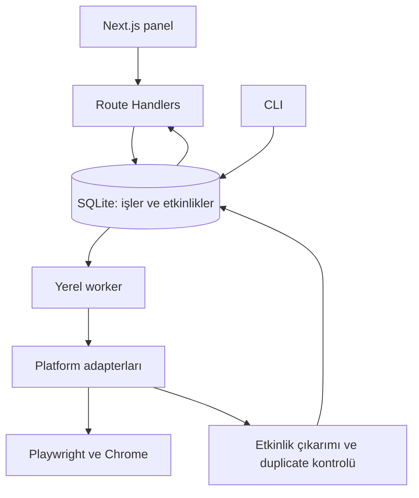

**Etkinlik Radarı — Next.js proje mimarisi ve MVP geliştirme planı**

Bu belge, MacBook üzerinde çalışacak kişisel etkinlik keşif uygulamasının geliştirme planıdır. Uygulanmış veya canlı sosyal medya hesaplarında test edilmiş bir yazılım teslimi değildir. Arayüz Next.js ile hazırlanır; Playwright otomasyonu aynı proje içindeki ayrı bir Node.js worker sürecinde çalışır. Tüm uygulama verisi ve tarayıcı oturumu bilgisayarda kalır. Sosyal medya sitelerine erişmek için internet gerekir.

**1. Temel mimari kararı**

Tek repository ve tek uygulama paketi yeterlidir. Next.js paneli, API katmanı, CLI ve worker aynı TypeScript tiplerini ve servislerini paylaşır. Ayrı Express sunucusu, Redis, Docker veya ücretli scraping servisi ilk sürüm için gerekli değildir.

| Katman | Seçim | Sorumluluk |
| --- | --- | --- |
| Panel | Next.js App Router, TypeScript | Etkinlikler, tarama formu, sonuçlar, bağlantı durumu |
| UI | Tailwind CSS, shadcn/ui | Tablo, filtre, form, dialog, durum göstergeleri |
| Form ve doğrulama | React Hook Form, Zod | Tarama seçeneklerini ve ayarları doğrulama |
| Canlı durum | TanStack Query, periyodik sorgulama | Devam eden taramanın sayaçlarını yenileme |
| HTTP API | Next.js Route Handlers, Node.js runtime | İş oluşturma, durum okuma, iptal talebi, etkinlik düzenleme |
| Tarama | Ayrı Node.js + TypeScript worker | Kuyruk, tarayıcı sahipliği, adapter çalıştırma |
| Tarayıcı | Playwright, görünür Chrome | Oturum kullanımı ve sosyal medya gezinmesi |
| Veritabanı | SQLite + Drizzle ORM + better-sqlite3 | Etkinlikler, kaynaklar, işler, ilerleme |
| Yardımcı araçlar | tsx, Pino | TypeScript CLI/worker ve yapılandırılmış log |
| Doğrulama | Vitest, Playwright | Parser/dedup testleri ve uygulama kabul senaryoları |

Kurulum sırasında güncel ve birbiriyle uyumlu kararlı sürümler seçilip lockfile ile sabitlenir. Node sürümü de proje içinde sabitlenir. Drizzle'ın SQLite ve better-sqlite3 desteği resmî belgede bulunur [3]. Node API'lerine ihtiyaç duyan Next.js route'ları Node.js runtime kullanır [4].

Önerilen veri akışı:



`POST /api/scans`, işi veritabanına kaydedip `202 Accepted` ve `runId` döndürür. Worker sıradaki işi alır. Tarayıcı işlemleri HTTP isteğinin içinde başlatılıp arka planda sahipsiz bırakılmaz. Panel kapanırsa worker taramayı sürdürebilir; bilgisayarın veya worker'ın kapanması taramayı keser.

**2. Chrome oturumu**

Mevcut Chrome'da hesabın açık olması, Playwright'ın o oturuma otomatik bağlanabileceği anlamına gelmez. Chrome 136 ile varsayılan veri dizininde `--remote-debugging-port` ve `--remote-debugging-pipe` kullanımı kısıtlandı; bu anahtarlar standart dışı bir `--user-data-dir` gerektiriyor [1]. Playwright da varsayılan Chrome profilini otomasyonda kullanmayı desteklemiyor [2].

İki çalışma modu tasarlanır:

| Mod | Davranış |
| --- | --- |
| `cdp` | Kullanıcının uygun ayrı veri diziniyle ve debugging açık başlattığı Chrome'a `connectOverCDP` ile bağlanır. O profil içindeki mevcut oturumları kullanır. |
| `persistent` | Uygulamaya ayrılmış kalıcı profili `launchPersistentContext` ile açar. İlk kullanımda kullanıcı LinkedIn/X girişini tarayıcıda yapar; profil sonraki çalıştırmalarda saklanır. |

Varsayılan MVP modu `persistent` olur. Geçerli bir CDP adresi sağlanmışsa `cdp` seçilebilir. Oturum platform tarafından sonlandırılırsa yeniden kullanıcı girişi gerekir; sürekli oturum garantisi verilmez.

Profil, SQLite ve loglar proje kodundan ayrı tutulur. Önerilen macOS veri kökü: `~/Library/Application Support/EventRadar/`. Uygulama bu yolu mutlak yola çözer. Profil için `browser-profile/`, veritabanı için `events.sqlite`, loglar için `logs/` alt yolları kullanılır. İşletim sistemi dosya izinleri kullanıcıyla sınırlandırılır.

Profil tek worker tarafından yönetilir. Aynı profili ikinci süreç açmaya çalışırsa anlaşılır hata verilir. CDP modunda worker sadece kendisinin açtığı sekmeleri kapatır; kullanıcının tarayıcısını kapatmaz. Persistent modda kendi açtığı context'i kapatır. CDP yalnızca loopback adresine bağlanır.

Bağlantılar sayfası `ready`, `login_required`, `challenge`, `unsupported` ve `error` durumlarını gösterir. Oturum kontrolü ve tarayıcı açma komutlarını da worker yürütür; Next.js ikinci bir profil açmaz. Şifreler uygulama formundan alınmaz. Cookie/session değerleri kod, log, API yanıtı veya export dosyasına yazılmaz.

**3. Klasör ve dosya yapısı**

| Yol | İçerik |
| --- | --- |
| `src/app/layout.tsx` | Ana uygulama yerleşimi |
| `src/app/page.tsx` | Özet ekranı |
| `src/app/events/page.tsx` | Etkinlik listesi |
| `src/app/events/[id]/page.tsx` | Etkinlik, kanıt metni ve kaynaklar |
| `src/app/scans/page.tsx` | Yeni tarama ve geçmiş |
| `src/app/scans/[id]/page.tsx` | İlerleme, sayaçlar, platform hataları |
| `src/app/connections/page.tsx` | Chrome ve platform oturum durumu |
| `src/app/settings/page.tsx` | Kelimeler, hashtagler, limitler |
| `src/app/api/` | HTTP uçları; ince doğrulama ve servis çağrıları |
| `src/components/ui/` | shadcn/ui bileşenleri |
| `src/features/events/` | Etkinlik tablosu, filtre, detay ve düzenleme |
| `src/features/scans/` | Tarama formu ve ilerleme bileşenleri |
| `src/features/connections/` | Platform bağlantı kartları |
| `src/core/types/` | Event, SocialPost, ScanOptions ve adapter sözleşmeleri |
| `src/core/parsers/` | event-parser, date-parser, location-parser, url-parser |
| `src/core/services/` | event-service, duplicate-detector, scan-service, config-service |
| `src/core/config/` | Zod şemaları, varsayılanlar ve config yükleyici |
| `src/core/utils/` | Metin normalizasyonu, tarih ve URL yardımcıları |
| `src/platforms/registry.ts` | Kullanılabilir adapter kaydı |
| `src/platforms/linkedin/` | adapter.ts, selectors.ts, post-parser.ts, search-builder.ts |
| `src/platforms/twitter/` | X için aynı dosyalar; uygulama platform anahtarı `x` |
| `src/platforms/instagram/` | İkinci aşama adapterı |
| `src/platforms/tiktok/` | İkinci aşama adapterı |
| `src/browser/` | browser-manager.ts, session-check.ts, profile-lock.ts |
| `src/database/` | schema.ts, client.ts ve repositories/ |
| `src/worker/` | index.ts, job-runner.ts, rate-limiter.ts, recovery.ts |
| `src/cli/` | index.ts, search.ts, list.ts, doctor.ts |
| `config/search.example.json` | Tüm kelimeleri içeren başlangıç ayarları |
| `drizzle/` | SQL migration dosyaları |
| `scripts/` | Geliştirme ve yerel başlatma koordinasyonu |
| `tests/` | fixtures/, parsers/, dedup/, jobs/, e2e/ |

`src/core` HTTP, React veya Next.js'e bağımlı olmaz. Tarayıcıya ve veritabanına erişen modüller Client Component'lere aktarılmaz. Next.js API ve CLI, ortak servisleri çağırır; iş mantığı route dosyalarında tekrarlanmaz.

**4. Panel ekranları**

| Ekran | Temel içerik |
| --- | --- |
| Genel bakış | Yaklaşan etkinlikler, incelenecek kayıtlar, son tarama, worker durumu |
| Etkinlikler | Tarih, başlık, şehir/online, organizatör, platformlar, kaynak ve kayıt bağlantıları |
| Etkinlik detayı | Tüm kaynak paylaşımlar, ham metin, alanların kanıtları, düzeltme ve kayıt reddetme |
| Yeni tarama | Platform, şehir, anahtar kelime/hashtag, son X gün, tarama sınırları |
| Tarama detayı | Aktif platform/sorgu, süre, sayaçlar, uyarılar, iptal düğmesi |
| Bağlantılar | Chrome modu, profil durumu, platform giriş kontrolü |
| Ayarlar | Düzenlenebilir sorgular, beklemeler, varsayılan filtreler |

Etkinlikler varsayılan olarak gelecek tarihe göre sıralanır; geçmiş kayıtlar gizlenir. Tarihi belirsiz kayıtlar ayrı “İncelenecek” filtresindedir. Aynı etkinliğin platformları tek satırda rozetlerle gösterilir. İlk sürüm için tablo ve detay görünümü yeterlidir.

**5. Veri modeli**

| Tablo | Alanlar / işlev |
| --- | --- |
| `Event` | `id`, `title`, `normalizedTitle`, `description`, `startDate`, `endDate`, `startTime`, `endTime`, `timeZone`, `datePrecision`, `venue`, `city`, `country`, `attendanceMode`, `organizer`, `registrationUrl`, `status`, `confidence`, `firstDiscoveredAt`, `updatedAt`, `manuallyEditedFields` |
| `SocialPost` | `id`, `platform`, `platformPostId`, `canonicalUrl`, `accountName`, `accountUrl`, `publishedAt`, `publishedAtPrecision`, `rawText`, `extractedLinks`, `firstSeenAt`, `lastSeenAt` |
| `EventSource` | `eventId`, `postId`, `evidenceJson`, `parserVersion`; bir etkinliğin birçok kaynağını ve bir paylaşımın birçok etkinliğini bağlar |
| `ScanRun` | `id`, `kind`, `status`, `configSnapshot`, `createdAt`, `startedAt`, `finishedAt`, `cancelRequestedAt`, `workerId`, `heartbeatAt`, `leaseExpiresAt`, `countersJson` |
| `ScanTask` | `id`, `runId`, `platform`, `query`, `status`, `attempt`, `checkpointJson`, `lastError`, görev sayaçları |
| `ScanObservation` | `taskId`, `postId`, `observedAt`; hangi taramada hangi paylaşımın görüldüğünü tutar |
| `ReviewItem` | `id`, `eventId`, `candidateEventId`, `reason`, `status`, `createdAt`; belirsiz çıkarım ve olası duplicate incelemesi |

`ScanRun.kind`, `scan`, `session_check` veya `open_login` olabilir. Böylece profil erişimi tek iş kuyruğundan geçer. Bir `SocialPost` birden çok etkinlik içerirse parser bir liste döndürür; bağlantı tablosu bunu destekler.

`attendanceMode`: `online`, `physical`, `hybrid`, `unknown`. Boolean zorunluysa `online` alanı nullable tutulur; bilgi yokluğu `false` sayılmaz.

`Event.status`: `upcoming`, `ongoing`, `expired`, `needs_review`, `rejected`. Zaman statüsü okuma sırasında güncel saate göre de hesaplanır; kullanıcı haftalar sonra paneli açtığında eski `upcoming` değerleri gösterilmez.

Tarih ve saat bilgileri ayrı saklanır. Saat bilinmiyorsa `00:00` uydurulmaz. Türkiye etkinlikleri için `Europe/Istanbul` varsayımı ancak ilgili ülke bağlamı varsa ve çıkarım olarak işaretlenerek kullanılabilir. Keşif ve işlem zamanları UTC tutulur.

Unique kurallar: platform içi gönderi ID'si mevcutsa `(platform, platformPostId)`, ayrıca normalize edilmiş `(platform, canonicalUrl)`; `EventSource(eventId, postId)` ve `ScanObservation(taskId, postId)` benzersiz olur. Başlık tek başına unique yapılmaz. `Event` üzerindeki kaynak alanları, çoklu kaynak olduğu için `EventSource` ilişkisi üzerinden sunulur.

SQLite aynı yerel dosyayı iki süreçten kullanır. WAL, her bağlantıda foreign key kontrolü ve `busy_timeout` uygulanır; yazma transaction'ları kısa tutulur. WAL birden fazla eşzamanlı yazarı mümkün kılmaz [5]. Tarayıcıdan yanıt beklerken DB transaction'ı açık tutulmaz.

**6. Adapter sözleşmesi ve tarama**

```ts
type Platform = 'linkedin' | 'x' | 'instagram' | 'tiktok';

interface PlatformScanner {
  readonly platform: Platform;
  readonly capabilities: {
    keywordSearch: boolean;
    hashtagSearch: boolean;
    nativeDateFilter: boolean;
  };
  checkSession(context: ScannerContext): Promise<SessionResult>;
  search(
    options: SearchOptions,
    context: ScannerContext,
  ): AsyncIterable<RawPost>;
  parsePost(raw: RawPost): SocialPostDraft | null;
  getPostUrl(raw: RawPost): string | null;
  getAuthor(raw: RawPost): Author | null;
}
```

Bu sözleşme taslağındaki yardımcı tipler `src/core/types` altında tanımlanır. `ScannerContext`, worker'ın verdiği sayfa/context, limiter, logger ve iptal sinyalini taşır. Adapter kendi sınırsız browser instance'ını açmaz. Platforma özgü DOM çıkarımı `parsePost` içinde; etkinlik çıkarımı ortak `event-parser` içindedir.

Her adapter kendi arama URL'sini, selector'larını, login/challenge işaretlerini ve boş sonuç tespitini içerir. Selector'lar gerçek tarayıcı gözlemiyle belirlenir; varsayımsal selector'lar “çalışıyor” kabul edilmez. “Sonuç yok” ile “DOM değişti” ayrı sonuçlardır.

Worker önce LinkedIn, sonra X görevlerini sırayla yürütür. Kayıtlar stream olarak işlenip küçük transaction'larla kaydedilir. Aynı paylaşım farklı sorguda tekrar görünürse yeni etkinlik olarak sayılmaz. Bir platformun hatası kalan platform görevlerini durdurmaz. Sadece ortak Chrome'un kaybedilmesi gibi genel sorunlarda iş durdurulup açıklama kaydedilir.

MVP'de Instagram ve TikTok seçimi devre dışıdır. İkinci aşamada her birinin gerçek arama kabiliyeti, oturum ve bölge farkları gözlenir. Özellikle hashtag sayfasına erişmek, genel anahtar kelime aramasının desteklendiği anlamına gelmez.

**7. Etkinlik çıkarımı ve tarih doğruluğu**

İlk sürüm tamamen yerel, kural tabanlı çalışır. Bulut LLM gerektirmez. Parser metni normalize eder, etkinlik niyeti arar, konu uygunluğunu değerlendirir, tarih/yer/organizatör/link kanıtlarını çıkarır. Sonuç `EventCandidate[]` olur.

Bir paylaşımda yalnızca `startup` veya `AI` geçmesi etkinlik sayılması için yeterli değildir. “Meetup”, “buluşuyoruz”, “konferans”, “kayıtlar açıldı”, yer ve tarih gibi birden fazla sinyal birlikte değerlendirilir. İş ilanı, ürün reklamı ve geçmiş etkinlik özeti gibi metinler ayırt edilir.

| Durum | Davranış |
| --- | --- |
| Açık gelecek etkinlik tarihi ve uygun konu | `upcoming` adayı |
| Açık geçmiş bitiş tarihi | `expired`; varsayılan listede gizli |
| Güçlü etkinlik duyurusu, tarih yok | `needs_review` |
| “Yarın”, “bu cuma” | Güvenilir paylaşım tarihi ve saat dilimi üzerinden çöz; bunlar yoksa incelemeye bırak |
| Yıl belirtilmemiş | Otomatik gelecek yıla taşıma; bağlam yetmiyorsa incelemeye bırak |
| Kayıt son tarihi ve etkinlik tarihi birlikte | Alanları ayır; kayıt son tarihini başlangıç yapma |
| Tarih aralığı | Başlangıç/bitişi koru; aralık bitmeden geçmiş sayma |
| Bilgi yalnızca afiş veya videoda | Metinle çıkarılamayan alanları boş bırak; OCR/video çözümleme sonraki aşama |

Mekân, şehir ve organizatör ayrı alanlardır. Paylaşan hesap otomatik olarak organizatör kabul edilmez. Her çıkarımın dayandığı metin parçası saklanır. Confidence, kural puanıdır; istatistiksel doğruluk yüzdesi gibi sunulmaz.

`lastDays` filtresi paylaşım tarihine, etkinlik filtresi etkinlik tarihine uygulanır. Platform destekliyorsa tarih araması kullanılır; sonuçlar `publishedAt` ile de kontrol edilir. Paylaşım tarihi belirlenemeyenler katı son-X-gün sonucuna dahil edilmez ve ayrıca sayılır. Bu filtre, platformun bütün paylaşımlarının eksiksiz tarandığı anlamına gelmez.

Türkiye önceliği sıralama ve sorgu planlamasıyla sağlanır. Şehir karşılaştırmasında İstanbul/istanbul, İzmir/izmir gibi Türkçe normalizasyon uygulanır. Şehir filtresinde online etkinliklerin dahil edilmesi ayrı seçenek olur; global online etkinliğe şehir uydurulmaz.

**8. Duplicate kontrolü**

Önce kaynak paylaşım tekilleştirilir, sonra etkinlik eşleştirmesi yapılır. Genel organizatör anasayfası veya tekrar kullanılan kayıt adresi tek başına kesin eşleşme değildir.

| Kanıt | Karar |
| --- | --- |
| Aynı kaynak gönderi | Yeniden kayıt açma; son görülme ve gözlem ilişkisini güncelle |
| Etkinliğe özel aynı kayıt kimliği/URL'si ve uyumlu tarih | Güçlü eşleşme |
| Benzer başlık, aynı tarih, uyumlu şehir ve organizatör | Güçlü eşleşme adayı |
| Benzer açıklama, eksik tarih veya çelişen şehir | Otomatik birleştirme yerine `ReviewItem` |
| Aynı seri adı ve farklı tarihler | Ayrı etkinlikler |

UTM gibi bilinen takip parametreleri temizlenir; etkinlik ID'si taşıyan query parametreleri korunur. Kısa URL'ler çözülmemişse eşitlik varsayılmaz. Aynı gün farklı saatlerdeki ayrı oturumlar da dikkate alınır.

Eşleşme transaction içinde tekrar doğrulanır. Birleşmede kaynak bağlantıları korunur; daha dolu bilgiler ancak çelişki yoksa eklenir. Kullanıcının elle düzelttiği alanlar sonraki taramalarda otomatik ezilmez. İki farklı tarihin bulunduğu erteleme duyurusunda otomatik karar yerine inceleme kaydı açılır.

**9. Kuyruk, sınırlar ve hata yönetimi**

Başlangıç için önerilen limitler ürün ayarıdır; platformların ilan ettiği güvenli kota olarak yorumlanmaz:

| Ayar | Başlangıç değeri |
| --- | --- |
| Eşzamanlı browser görevi | 1 |
| Platform başına sorgu | En fazla 3 |
| Sorgu başına paylaşım | En fazla 15 |
| Platform başına toplam benzersiz paylaşım | En fazla 30 |
| Tarama başına toplam benzersiz paylaşım | En fazla 60 |
| Sorgu başına scroll | En fazla 3 |
| Gezinme/scroll arası bekleme | 4–8 saniye, ayarlanabilir |
| Geçici ağ hatası tekrar sayısı | En fazla 2, artan bekleme |
| Tarama süre bütçesi | 15 dakika |

Beklemeler trafik yükünü azaltır; platform kısıtlarını veya erişim kontrolünü aşma amacı taşımaz. Rate-limit yanıtında varsa `Retry-After` dikkate alınır. CAPTCHA ve giriş doğrulaması otomatik aşılmaz; ilgili platform `login_required` veya `challenge` durumuna alınır, kullanıcı panelden bilgilendirilir.

İş durumları `queued`, `running`, `completed`, `partial`, `failed`, `cancelled`, `interrupted` olur. Platform görevleri ayrıca neden kodu taşır. LinkedIn başarısız, X başarılıysa tarama `partial` biter. Limit dolması hata değildir; `stopReason` ile kaydedilir.

Worker işleri transaction içinde atomik sahiplenir; `heartbeatAt` ve lease yeniler. İkinci worker veya CLI aynı işi eşzamanlı yürütemez. Profil kilidi ayrıca uygulanır. Uygulama kapanması/uyku sonrası lease süresi dolan işler kurtarma sırasında `interrupted` işaretlenir; son görev kontrol noktasından yeniden deneme idempotent kayıtlarla yapılır. Eski worker kilidinin hâlâ geçerli olup olmadığı doğrulanmadan profil devralınmaz.

İptal talebi DB'ye yazılır; worker gezinme ve scroll adımları arasında kontrol eder. Devam eden ağ işlemleri için timeout ve mümkün olan yerlerde iptal sinyali kullanılır. Önceden kaydedilmiş sonuçlar korunur.

**10. Arama ayarları**

`config/search.example.json` tüm kullanıcı kelimeleri ve hashtaglerini içerir. İlk başlatmada kullanıcı veri klasöründeki `search.json` oluşturulur. Ayarlar ekranı bu tek dosyayı Zod ile doğrulayıp atomik değiştirir. Her tarama, kullandığı ayarların anlık kopyasını `configSnapshot` içine alır.

Kısa config örneği:

```json
{
  "version": 1,
  "enabledPlatforms": ["linkedin", "x"],
  "preferredCountry": "TR",
  "defaultTimeZone": "Europe/Istanbul",
  "keywords": ["yazılım etkinliği", "startup meetup", "hackathon"],
  "hashtags": ["yazılım", "startup", "meetup", "hackathon"],
  "filters": {
    "city": null,
    "lastDays": 30,
    "includeOnline": true,
    "includeExpired": false,
    "unknownPublishedAt": "exclude_from_date_filtered_results"
  },
  "limits": {
    "maxQueriesPerPlatform": 3,
    "maxPostsPerQuery": 15,
    "maxPostsPerPlatform": 30,
    "maxPostsPerRun": 60,
    "maxScrollsPerQuery": 3,
    "minDelayMs": 4000,
    "maxDelayMs": 8000,
    "maxRunMinutes": 15
  }
}
```

Tam başlangıç keyword listesi: yazılım etkinliği, developer meetup, software meetup, startup etkinliği, girişimcilik etkinliği, teknoloji etkinliği, teknoloji konferansı, AI event, artificial intelligence, yapay zekâ etkinliği, hackathon, startup meetup, networking event, founder meetup, SaaS event, product meetup, developer conference, software conference, girişimci buluşması, startup networking, teknoloji zirvesi, workshop, bootcamp, demo day, pitch event.

Tam hashtag listesi: yazılım, startup, girişimcilik, teknoloji, yapayzeka, artificialintelligence, meetup, hackathon, developer, networking, saas, founder, demoday. Dosyada `#` olmadan tutulur; adapter gerektiğinde ekler.

Varsayılan tarama bütün kelimeleri tüm şehirlerle çarpmaz. Sorgular limit dahilinde seçilir; sonraki çalıştırmada döndürülerek kapsama genişletilir. Kullanıcı özel keyword veya hashtag girdiyse önce o uygulanır. Şehir filtresi hem desteklenen arama biçimine hem çıkarılan etkinlik verisine uygulanır; serbest metin sorgusuna şehir eklemek tek başına kesin filtre sayılmaz.

**11. API ve CLI sözleşmesi**

| Metot / yol | İşlev |
| --- | --- |
| `GET /api/events` | Sayfalı liste; tarih, şehir, platform, durum ve online filtresi |
| `GET /api/events/[id]` | Etkinlik ve tüm kaynakları |
| `PATCH /api/events/[id]` | Kullanıcının doğruladığı alan düzeltmeleri ve reddetme |
| `POST /api/scans` | Doğrula, işi kuyruğa koy, `202` ve `runId` döndür |
| `GET /api/scans` | Tarama geçmişi |
| `GET /api/scans/[id]` | İş/görev durumları, sayaçlar, hata özeti |
| `POST /api/scans/[id]/cancel` | İptal talebi |
| `GET /api/connections` | Son oturum kontrol sonuçları |
| `POST /api/connections/check` | Worker'a oturum kontrol işi |
| `POST /api/connections/open` | Seçilen platformun giriş ekranını worker üzerinden aç |
| `GET /api/settings` | Düzenlenebilir arama ayarları |
| `PUT /api/settings` | Doğrulanmış ayar dosyasını güncelle |
| `GET /api/health` | DB, config ve worker heartbeat durumu |

Panel yalnızca aktif taramada yaklaşık 2 saniyede bir durum sorgular. Terminal duruma ulaşıldığında polling durur. MVP için WebSocket gerekmiyor. Next.js veri yanıtları tarama durumunu eski cache'den döndürmeyecek şekilde düzenlenir.

Planlanan komutlar:

```bash
npm run dev
npm run build
npm run start
npm run worker
npm run doctor
npm run search
npm run search -- --platform=linkedin
npm run search -- --platform=x --city=istanbul --keyword=startup --days=14
npm run search -- --hashtag=hackathon
npm run events -- --city=eskisehir
```

`dev` ve `start` koordinatörleri Next.js ile tek worker'ı birlikte başlatır. `worker` ayrı terminalde çalıştırma içindir. `search` ortak servisle DB'ye iş ekler ve ilerlemeyi izler; mevcut worker yoksa tek seferlik worker başlatmayı profil kilidiyle dener. Böylece CLI kullanımı Next.js panelinin açık olmasını gerektirmez. `--platform=twitter` değeri `x` için alias kabul edilebilir.

`doctor`, Node/Chrome kullanılabilirliğini, veri dizini izinlerini, migration durumunu, profil kilidini ve worker durumunu kontrol eder. Oturum değerlerini çıktıya koymaz.

Sayaçlar ayrı anlam taşır: taranan benzersiz paylaşım, yeniden görülen paylaşım, potansiyel etkinlik adayı, eklenen yeni etkinlik, mevcut etkinlikle birleşen aday, incelenecek kayıt, tarih filtresi nedeniyle elenen kayıt, platform hata sayısı. Aynı gönderiye yeniden rastlamak ile aynı etkinliğin farklı platform kaynağını bulmak aynı duplicate sayacı değildir.

CLI sonunda örnek biçim:

```text
[12 Ekim 2026] AI Startup Meetup — İstanbul
Platformlar: LinkedIn, X
Organizatör: Example Community
Kayıt: kaynaktan çıkarılan bağlantı veya "Bulunamadı"
Kaynaklar: doğrulanmış orijinal paylaşım bağlantıları
```

Bu örnek yalnızca çıktı biçimidir; gerçek bulunmuş etkinlik değildir.

**12. Yerel çalışma sınırı**

Next.js `127.0.0.1` üzerinde dinler; MVP internete yayınlanmaz. Değişiklik yapan API uçlarında beklenen Host/Origin kontrolü ve yerel uygulama oturumu/CSRF koruması uygulanır. Sosyal medya metinleri HTML olarak çalıştırılmaz. Dış bağlantılar yalnızca geçerli `http`/`https` URL'leri olarak sunulur.

MVP kayıt linklerini kendiliğinden takip edip form göndermez; paylaşımda görülen bağlantıları çıkarır. Böylece botun görevi etkinlik keşfiyle sınırlı kalır. Post metni veri kabul edilir; uygulama komutlarını değiştiremez. Tanılama ekran görüntüleri gerektiğinde yerel tutulur ve saklama süresiyle temizlenir.

`.env.example` sadece veri dizini, browser modu ve CDP adresi gibi hassas olmayan ayar isimlerini gösterir. Gerçek `.env`, browser profili, SQLite, loglar ve tanılama çıktıları Git'e eklenmez. Uygulamanın config dosyası tarama davranışını; profil klasörü oturumu saklar.

**13. Uygulama sırası ve kabul ölçütleri**

| Aşama | Yapılacak iş | Tamamlanma kanıtı |
| --- | --- | --- |
| 1 | Next.js iskeleti, sayfalar, ortak tipler, SQLite migration | Yerel panel açılır; DB oluşturulur; restart sonrası kayıt kalır |
| 2 | Worker kuyruğu, profil yöneticisi, bağlantılar ekranı | İş tek kez sahiplenilir; profil çatışması anlaşılır; Chrome açılır |
| 3 | LinkedIn adapterı ve sınırlı canlı arama | Gerçek sonuçtan metin, hesap, permalink alınır; açık oturum sonraki başlatmada kullanılır |
| 4 | Tarih/etkinlik parser'ı, kayıt ve dedup | Gelecek/geçmiş/belirsiz tarih ayrılır; aynı veri ikinci kez eklenmez |
| 5 | X adapterı | Canlı sonuç okunur; LinkedIn hatasında X görevi devam eder |
| 6 | Panel filtreleri, CLI, iptal ve kurtarma | Panel kapanınca worker sürer; iptal uygulanır; kesilmiş iş doğru işaretlenir |
| 7 | Instagram, ardından TikTok | Her platformun gerçek kabiliyetleri ayrı canlı testle doğrulanır |

Parser ve dedup testleri; Türkçe ay adları, 31 Aralık/1 Ocak sınırı, çok günlük etkinlik, saatsiz tarih, “yarın”, kayıt son tarihi, tekrar eden meetup, aynı URL'nin farklı tarihli kullanımı ve aynı post içindeki iki etkinliği kapsar.

Canlı tarayıcı kabulünde boş sonuç, oturum süresi dolması, challenge, değişen selector, platform hatası, yeniden tarama ve tek profile iki süreç erişimi denenir. Test kanıtları platform, tarih, taranan örnek sayısı ve sonucu içerir; oturum bilgilerini içermez. Kullanıcı MacBook'unda test yapılmadan bu kısım tamamlandı olarak işaretlenmez.

İlk sürümün teslim ölçütü: MacBook'ta panel ve CLI çalışır; LinkedIn/X taramaları kontrol edilebilir; kaynaklar korunarak etkinlikler SQLite'a kaydedilir; belirsizlikler görünürdür; tekrar tarama veri çoğaltmaz; platform hatası kalan işi engellemez. Instagram/TikTok, OCR, yerel LLM ve zamanlanmış tarama bu temel doğrulandıktan sonra ele alınır.

**Başvurulan resmî belgeler**

1. [Chrome: Remote debugging değişiklikleri](https://developer.chrome.com/blog/remote-debugging-port)
2. [Playwright: BrowserType, persistent context ve CDP](https://playwright.dev/docs/api/class-browsertype)
3. [Drizzle: SQLite sürücüleri](https://orm.drizzle.team/docs/sqlite/get-started-sqlite)
4. [Next.js: Node.js ve Edge runtime](https://nextjs.org/docs/app/api-reference/edge)
5. [SQLite: Write-Ahead Logging](https://www.sqlite.org/wal.html)
6. [SQLite: Busy timeout](https://www.sqlite.org/c3ref/busy_timeout.html)

Bu kaynaklar altyapı kabiliyetlerini doğrular. Platform adapterlarının bugünkü selector'larını veya hesap bazlı erişilebilirliğini doğrulamaz; bunlar uygulama sırasında gerçek tarayıcıyla gözlenmelidir.
